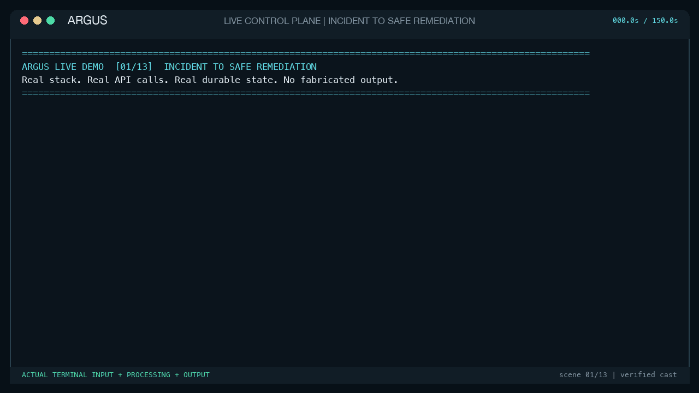

# Argus

[](https://github.com/gaurav-gs7/Argus/actions/workflows/ci.yml)

Argus is a production-style SRE control plane for incident detection, deterministic RCA, and safe policy-gated auto-remediation.



It is designed to feel like an internal reliability platform rather than a generic AI log chatbot:

- incidents are created from observability signals
- dependency-aware correlation collapses downstream alert storms into one root incident
- RCA is built from deterministic evidence first
- the LLM is advisory only and never in the correctness path
- Verdikt governs every AI remediation proposal in policy-only mode
- remediations are typed, idempotent, policy-gated, and recorded in a tamper-evident audit ledger
- medium-risk actions enter a durable, identity-bound human approval workflow

## Why This Isn't A Log Chatbot

An LLM agent that owns RCA must infer causality from incomplete, attacker-influenceable telemetry; its conclusion can change between runs, invent evidence, group symptoms incorrectly, and leave no reproducible decision path before invoking a tool. Argus instead normalizes and stores every signal, correlates incidents through a persisted service graph, ranks hypotheses with fixed evidence rules and inspectable arithmetic, and permits only typed actions through deterministic policy, idempotency, and identity-bound approval. The LLM receives bounded structured evidence only after that work, so it can summarize or explain a recommendation but cannot alter the evidence, score, policy decision, approval, or execution; if the model is unavailable or returns invalid output, the deterministic incident pipeline still works.

## Judikt Finding Ingestion

Judikt's durable finding outbox calls Argus directly: it sends an Alertmanager-compatible `POST /v1/alerts/alertmanager` with an OIDC bearer service identity that has `ingest_signal`; it does **not** bypass correlation by calling the manual incident API. Judikt maps its five-minute finding dedupe key to the alert fingerprint, so Argus derives `service + JudiktMCPSecurityFinding + environment + fingerprint`, reuses the open incident on retry, and still retains every delivery as signal and timeline evidence. A successful `202` response returns the created or reused incident ID; `POST /v1/incidents/{id}/rca/generate` then runs the same deterministic RCA path used by observability alerts. The [complete producer/consumer contract](docs/integrations/judikt.md), [real Judikt-shaped fixture](demo/alerts/judikt_security_finding.json), and [PostgreSQL integration test](internal/incidents/service_integration_test.go) make the two-sided claim verifiable. Judikt creates security incidents; the separate Verdikt integration governs AI remediation proposals.

## Why This Stack

This repository is intentionally optimized for local development on a MacBook Air M2 with 8 GB RAM:

- Go for the control plane, worker, CLI, and demo workloads
- Python FastAPI for the advisory AI service
- Verdikt as the non-executing governance gateway for AI proposals
- PostgreSQL for durable state
- NATS JetStream for durable event and remediation delivery
- Redis for lightweight cache and coordination
- OIDC/JWT authentication with a resource-capped local Keycloak realm
- Prometheus, Alertmanager, Loki, Grafana, and OTel Collector for observability
- Docker Compose as the low-resource local default
- Helm and Kustomize packaging as an undeployed production stretch path

The default local profile keeps the AI service lightweight and mock-friendly. Ollama and Gemini can be enabled explicitly.

## Optional Helios Integration

Argus can delegate approved remediation execution to an external Helios control plane.

- `ARGUS_REMEDIATION_EXECUTOR=local` keeps execution inside Argus
- `ARGUS_REMEDIATION_EXECUTOR=helios` submits an execution workflow to Helios
- `ARGUS_HELIOS_BASE_URL` points at the Helios API
- `ARGUS_HELIOS_ADMIN_TOKEN` authenticates workflow submission and status reads

In the current bridge, Argus submits a trusted Helios `persist_artifact` workflow that records the remediation intent and execution metadata using Helios's durable execution path. This is intentional: Helios is now integrated as a real execution backend, while action-specific Helios remediation handlers can be added later without changing Argus policy or incident logic.

## Architecture

```text
OIDC/JWKS ---------------->+
Observability signals -> Service graph -> Root incident -> Deterministic RCA
                              |               |                 |
                              |               v                 v
                              |          PostgreSQL        AI advisory
                              |               |                 |
                              v               v                 v
                     Suppressed evidence  Audit chain    Verdikt PROPOSE_ONLY
                                                              |
                                                              v
                                                     Typed suggestions
                                                              |
                                               Go policy + human approval
                                                              |
                                                              v
                                                    NATS / Helios executor
```

## Test And Release Gate

The CI badge is backed by executable checks, not a build-only workflow. `make test` runs every Go package for repository-wide statement coverage, then runs the named deterministic decision-core packages in a second profile. The command fails below either checked-in floor.

```bash
make test

# Optional: retain profiles for local HTML inspection.
ARGUS_COVERAGE_DIR=artifacts/coverage make test
go tool cover -html=artifacts/coverage/decision-core.out
```

Current measured baselines are `27.3%` across all Go statements and `54.5%` across the decision core, with enforced floors of `25%` and `50%` respectively. The decision-core profile is not an unnamed exclusion list: [`scripts/check-go-coverage.sh`](scripts/check-go-coverage.sh) explicitly covers actions, OIDC authentication, configuration, correlation, policy, deterministic RCA, remediation contracts, topology, and typed workers.

| Release check | What it proves | CI command/job |
| --- | --- | --- |
| Go tests and coverage | 90 named unit/integration test functions; both coverage floors must pass | `make test` |
| Race detection | Concurrent Go tests are exercised under the race detector | `go test -race ./...` |
| PostgreSQL and JetStream integration | Incident dedupe/topology grouping, audit integrity, durable queue delivery, and replay-safe control state use real disposable services | `make integration-test` |
| Approval integration | Approval/expiry state and audit atomicity, Slack identity/reason binding, concurrent execution reservation, and publish rollback | `approval-integration` job |
| OIDC and RBAC E2E | JWT signature, issuer/audience/role claims, viewer/operator/admin boundaries, and immutable actor identity against local Keycloak | `make oidc-test` |
| AI adversarial tests | Nine prompt-injection, malformed tool output, candidate allow-list, topology contract, Verdikt `PROPOSE_ONLY`, internal auth, and AI metric checks | `make ai-test` |
| Deterministic RCA evaluation | Five scenario scores, replay stability, evidence dedupe, tie-breaks, topology bounds, and safe fallback arithmetic | `make rca-eval` |
| Terminal demo evidence | The committed 13-scene cast and looping `1280x720` GIF are exactly 150 seconds, contain every runtime proof marker, and leak no token or local path | `make terminal-demo-check` |
| Artifact and supply-chain checks | `go vet`, `govulncheck`, portable docs, Compose, Helm/Kustomize, Prometheus, Alertmanager, OPA, JSON/shell validation, and production image builds | `quality` job |

Coverage is intentionally reported without disguising service-backed gaps. The repository-wide profile runs without PostgreSQL or NATS, so conditional database/queue integration bodies do not raise its percentage; those paths are instead required in dedicated CI jobs. A passing gate means the listed contracts ran and the measured coverage did not regress below the floors. It does not mean every production failure mode is tested; the remaining outage and crash-injection gaps are listed in [Threat Model And Explicit Limitations](docs/threat-model.md).

## Deterministic RCA Scoring

Argus is rule-based; "deterministic" means the same persisted signals and topology always produce the same evidence, arithmetic, winner, and fallback without an LLM or random sampling. The correlator assigns explicit rule IDs, deduplicates evidence by `rule_id + type + source + summary`, and scores each hypothesis with:

```text
evidence_score = sum(evidence_confidence * evidence_weight)
final_confidence = clamp(0.35 + evidence_score, 0.35, 0.95)
```

| Rule | Normalized signal match | Evidence arithmetic | No-topology result |
| --- | --- | --- | --- |
| PostgreSQL exhaustion | `postgres` AND `connection` | `0.91x0.34 + 0.87x0.29 + 0.82x0.17` | `0.95` (capped) |
| Redis pressure | `redis` AND `memory` | `0.86x0.31 + 0.82x0.22` | `0.7970` |
| Nginx upstream/config | `nginx` AND `5xx` | `0.89x0.30 + 0.76x0.20` | `0.7690` |
| Dependency latency | `notification` OR `latency` | `0.84x0.30 + 0.77x0.18` | `0.7406` |
| Bad config rollout | `config` OR `parse` OR `rollout` | `0.93x0.35 + 0.85x0.24` | `0.8795` |

An observed topology root adds `0.03`, still capped at `0.95`; an inferred root adds nothing. If signal rules do not identify a failure mode, topology-only evidence yields `0.72` for an observed root or `0.58` for an inferred root and permits diagnostics only. With neither signal nor topology evidence, Argus returns `0.35` and `collect_diagnostics`. Equal hypothesis scores use lexical name ordering.

Each RCA report includes the individual `confidence x weight = contribution` factors. The full [scoring specification and trust boundary](docs/rca-scoring.md), [table-driven score tests](internal/rca/service_test.go), and [committed scenario evidence](docs/demo-evidence/README.md) make these claims reproducible. These values are operational heuristics, not statistical probabilities, and the current v1 text classifier does not independently attest that a canonical metric/log/trace came from its named backend.

### Worked Evidence Chain

For `PaymentsAPIPostgresConnectionExhaustion` with a `postgres connection acquisition timeout` annotation:

```text
persisted signal
  -> normalized name + source + type + JSON body
  -> rule_id: postgres_connection_exhaustion
  -> pool saturation:    0.91 x 0.34 = 0.3094
  -> acquisition timeout: 0.87 x 0.29 = 0.2523
  -> service impact:      0.82 x 0.17 = 0.1394
  -> evidence_score: 0.7011
  -> clamp(0.35 + 0.7011, 0.35, 0.95) = 0.9500
  -> typed candidates: drain connections, resize pool, restart pod
  -> Go policy + human approval; never direct LLM execution
```

Representative stored RCA output:

```json
{
  "primary_hypothesis": "PostgreSQL connection pool exhaustion",
  "confidence": 0.95,
  "model_backend": "deterministic",
  "evidence": [
    "postgres connection pool saturation crossed threshold",
    "application logs indicate postgres connection acquisition timeout",
    "payments-api error rate increased during the incident window"
  ],
  "contributing_factors": [
    "metric_anomaly from prometheus (confidence 0.91 x weight 0.34 = 0.3094)",
    "log_pattern from loki (confidence 0.87 x weight 0.29 = 0.2523)",
    "service_impact from alertmanager (confidence 0.82 x weight 0.17 = 0.1394)"
  ]
}
```

### Trust And Decision Authority

| Input or component | Trust boundary | Can affect RCA? | Can execute remediation? |
| --- | --- | --- | --- |
| Alert names, annotations, log text | Untrusted/operator-influenced | Yes, only through fixed predicates and bounded weights | No |
| Service dependency graph | Operator-managed durable state | Root selection; observed root adds at most `0.03` | No |
| Compiled Go rule table | Trusted correctness path, reviewed in CI | Defines rule IDs, weights, caps, ties, and typed candidates | No |
| LLM and Verdikt proposal path | External advisory/governance dependencies; malformed or unavailable responses fail closed | Cannot change evidence, score, target, or parameters | No |
| Go policy, OIDC identity, approval, worker | Authoritative execution path | Does not rewrite RCA | Yes, through registered handlers only |

### Reproducible Evaluation

```bash
make rca-eval
```

Current checked output:

```text
postgres   confidence=0.9500
redis      confidence=0.7970
nginx      confidence=0.7690
dependency confidence=0.7406
config     confidence=0.8795
100/100 deterministic replays identical
Validated deterministic RCA arithmetic for 5 scenarios.
```

The harness also verifies duplicate-evidence suppression, lexical score ties, unknown-signal fallback, observed/inferred topology bounds, and the rule that topology may identify a failure domain but cannot invent a component failure mode. CI runs it as the named `Evaluate deterministic RCA contract` step.

## Quick Start

`make up` bootstraps Verdikt beside Argus when needed. Compose uses only a relative, overridable build context and has no machine-specific imports.

```bash
make up
make seed
export ARGUS_API_TOKEN="$(./scripts/oidc-token.sh viewer)"
curl http://localhost:8080/healthz
curl -H "Authorization: Bearer ${ARGUS_API_TOKEN}" http://localhost:8080/v1/incidents
```

## One-Command Demo

For the full interview/reviewer experience, replay the committed 150-second terminal session. It uses terminal-native flowcharts for explanation, then shows actual API input, control-plane logs, PostgreSQL state, deterministic RCA output, Verdikt governance, approval denial/approval, JetStream execution, idempotency receipts, audit verification, and metrics:

```bash
make demo-terminal-replay
```

No running stack or recorder is required for replay. To execute the same presentation against the real local backend, run `make up`, `make seed`, then `make demo-terminal`; setup time is outside the 150-second content window. See the [scene timeline, live commands, and capture-integrity contract](docs/terminal-demo.md).

The focused scenario demo remains available:

```bash
make demo-postgres-exhaustion
```

That flow:

- injects a demo postgres exhaustion scenario
- posts an Alertmanager-style webhook
- creates or reuses an incident
- generates deterministic RCA
- proposes policy-gated remediation
- writes JSON evidence under `artifacts/demo-evidence/postgres_connection_exhaustion/`

The topology demo is the stronger incident-correlation walkthrough:

```bash
make demo-alert-storm
```

It sends twenty alerts across Nginx, checkout, payments, and PostgreSQL. Argus traverses the seeded dependency graph, opens one PostgreSQL-root incident, attaches eighteen downstream alerts as suppressed evidence, generates topology-enriched deterministic RCA, and writes the complete proof under `artifacts/demo-evidence/topology-alert-storm/`.

## Local Profiles

Normal profile:

- postgres
- redis
- nats
- keycloak
- argus-api
- argus-worker
- argus-ai
- verdikt
- prometheus
- grafana
- loki
- otel-collector
- payments-api

Full profile:

- everything above
- alertmanager
- nginx
- notification-api
- failure-injector
- optional ollama

## Kubernetes Packaging

Compose remains the supported development and demo path for an 8 GB Mac. Argus also includes a production-shaped Helm chart and Kustomize base/overlays so the runtime contract is not tied to one laptop:

```bash
make k8s-check
helm upgrade --install argus deploy/helm/argus \
  --namespace argus --create-namespace \
  -f deploy/helm/argus/values-production.yaml
```

The manifests deploy only Argus-owned API, worker, and AI workloads. They expect PostgreSQL, Redis, NATS, OIDC, Verdikt, DNS, TLS, ingress, and secret management to be supplied by the target platform. They include non-root security contexts, read-only root filesystems, resource limits, probes, PDB/HPA options, ingress, monitoring hooks, and network policies.

These manifests are rendered and linted in CI but are intentionally labeled a stretch path: they have not been certified against a live production cluster, and the example image tags, hostnames, identity provider, TLS secret, and runtime Secret must be replaced. See [docs/kubernetes.md](docs/kubernetes.md).

## OIDC Authentication And RBAC

Argus accepts short-lived, asymmetrically signed OIDC JWT access tokens. It validates the signature through the provider's rotating JWKS, exact issuer, `argus-api` audience, expiry, and an RS256 allow-list before reading identity or role claims. Provider roles are explicitly mapped to `admin`, `operator`, or `viewer`; missing, unknown, or conflicting Argus roles fail closed.

The local Compose profile includes a 768 MiB-capped Keycloak instance and three separate service accounts for repeatable automation:

```bash
export ARGUS_API_TOKEN="$(./scripts/oidc-token.sh operator)"
```

Those clients exist only in the local realm. Production uses the organization's OIDC provider over HTTPS, provider-managed users/groups, and secrets outside the repository. Set `ARGUS_OIDC_ISSUER_URL`, `ARGUS_OIDC_AUDIENCE`, and `ARGUS_OIDC_ROLE_MAPPINGS`; normally leave `ARGUS_OIDC_JWKS_URL` empty so standards-based discovery supplies the rotating key set.

Health, readiness, metrics, and the independently HMAC-verified Slack callback stay public. Every other `/v1/*` route requires a verified OIDC token. Authorization uses the mapped role, while audit and four-eyes controls use the immutable `issuer#sub` identity rather than mutable email or caller-provided fields.

## Governed AI Proposals

`POST /v1/incidents/{incident_id}/remediations/suggest` makes the authenticated Go control plane derive candidates and call the internal AI endpoint. The AI service accepts only Argus deterministic candidates. Model output is strict JSON, unknown fields fail closed, and each surviving proposal is sent to Verdikt's authenticated `/api/evaluate` endpoint. Verdikt returns `PROPOSE_ONLY` with `executed: false`; it never calls an upstream tool. Actual remediation still requires the independent Go policy, RBAC, approval, idempotency, and worker path.

Alert titles and log evidence are treated as untrusted data. Direct prompt-injection patterns and invisible Unicode controls are replaced with hashed placeholders before prompting, with block metrics exported to Prometheus.

A captured end-to-end governance run is committed at [docs/demo-evidence/ai-governance-verdikt.json](docs/demo-evidence/ai-governance-verdikt.json).

To exercise all four parameterized handlers through policy, approval, worker execution, replay, and audit verification:

```bash
make demo-typed-remediations
```

## Safety Model

- no arbitrary shell execution from the API
- remediations are registered typed handlers
- every remediation supports dry-run
- every remediation has a parameter-aware idempotency key
- pod restart, pool resize, feature-flag toggle, and cache purge enforce bounded typed inputs
- worker replays reuse durable PostgreSQL execution receipts instead of repeating side effects
- medium-risk actions create a PostgreSQL-backed approval request
- Slack or signed generic webhooks notify the on-call approver
- approval and denial require an authenticated identity and a reason
- the proposer cannot approve their own action by default
- unanswered requests escalate and then expire the remediation
- high-risk actions are blocked
- approval decisions commit their state transition and audit append atomically; other state-changing paths append to the same verifiable SHA-256 chain but do not yet share one transaction
- duplicate alerts are deduplicated
- downstream alert storms are grouped behind an observed or explicitly marked inferred root
- duplicate remediation executions are ignored

## Tamper-Evident Audit Ledger

Audit records are append-only and ordered by a transactionally locked chain head. Each entry stores its chain position, prior hash, SHA-256 entry hash, and hash version. The hash covers canonical JSON for the actor, action, resource, request context, before/after state, metadata, timestamp, and chain metadata. Approval decisions append their audit records inside the same PostgreSQL transaction as the approval and remediation transitions.

PostgreSQL triggers reject `UPDATE`, `DELETE`, and `TRUNCATE` on `audit_logs`. Argus verifies the complete chain at startup, every minute, and on demand:

```bash
export ARGUS_API_TOKEN="$(./scripts/oidc-token.sh admin)"
argus audit verify
```

Prometheus exposes `argus_audit_chain_integrity`, `argus_audit_chain_head_position`, and verification counters. The persisted chain head detects missing tail entries as well as modified or reordered rows. For a threat model that includes a compromised PostgreSQL owner rewriting both the ledger and its head, export and sign the head hash in an external immutable store; that external anchoring is intentionally outside the local v1 profile.

## Human Approval

The policy flag is not treated as approval. When policy returns `requires_approval`, Argus creates an `approval_requests` row bound to the exact remediation ID, action, target, parameters, incident, and deadline. Configure `ARGUS_APPROVAL_WEBHOOK_URL` with `ARGUS_APPROVAL_WEBHOOK_MODE=slack` for Slack notifications, or `generic` for a signed JSON notification. Generic payloads carry `X-Argus-Signature-256` when `ARGUS_APPROVAL_WEBHOOK_SECRET` is set.

Slack can complete the decision inside Slack: Argus verifies Slack's HMAC signature and five-minute replay window, checks an explicit `SLACK_USER_ID=argus-identity` allow-list, opens a modal that requires the approver's reason, and records the mapped identity. This requires a free Slack app with interactivity pointed at `/v1/approval-callbacks/slack`, plus `ARGUS_SLACK_SIGNING_SECRET`, `ARGUS_SLACK_BOT_TOKEN`, and `ARGUS_SLACK_APPROVERS`.

Approvers use the notification's decision endpoint or the CLI:

```bash
argus remediation approve rem_123 \
  --token "$(./scripts/oidc-token.sh admin)" \
  --reason "Reviewed RCA evidence; dry-run is scoped to payments-api"
```

Identity comes from the verified OIDC issuer and subject, never the request body. The approval decision, remediation transition, and audit entries commit in one PostgreSQL transaction. A background controller escalates once at `ARGUS_APPROVAL_ESCALATE_AFTER` and moves unanswered requests and their remediations to `expired`/`timed_out` at `ARGUS_APPROVAL_TIMEOUT`.

## Threat Model And Explicit Gaps

Argus keeps AI output outside the correctness path and separates authorization, policy, approval, and typed execution. It is not presented as a production-certified control plane. The table below separates demonstrated v1 behavior from unresolved production failure modes.

| Boundary | Demonstrated behavior | Explicit v1 gap |
| --- | --- | --- |
| Alert correlation | Exact dedupe keys, a bounded grouping window, deterministic topology walks, and retained downstream evidence | Missing fingerprints can collapse alerts with the same name; stale dependency edges can infer the wrong root; there is no topology freshness score |
| RCA | Fixed rule IDs, evidence weights, confidence contributions, stable tie-breaking, and a reproducible evaluation harness | Text classification still trusts normalized alert/log content as evidence; it does not attest source provenance or calibrate scores from production outcomes |
| PostgreSQL | Durable incidents, approvals, receipts, audit chain, and transactional local handler state | Incident ingestion spans multiple transactions, so a database failure can leave partial context; no HA, PITR, or automated failover is shipped |
| NATS JetStream | Durable manual-ack consumption and redelivery; handler receipts make local replay safe | There is no transactional outbox: an API crash after `approved -> queued` but before publish can strand a queued remediation; no automatic reconciler or dead-letter stream exists |
| Worker execution | Registered handlers validate bounded input, support dry-run, and reuse durable receipts | Exactly-once safety is proven only for the PostgreSQL-backed local adapters; a real external provider must supply its own idempotency token for the post-side-effect/pre-receipt crash window |
| Policy | Denies unknown/high-risk actions, validates typed parameters, rate-limits repeats, trips a local circuit breaker, and requires approval for medium risk | The v1 decision uses a fixed Go policy and local environment context; it does not re-evaluate at execution or consider change freezes, error budgets, live blast radius, ownership quorum, or external OPA bundles |
| Human approval | Durable request, verified OIDC/Slack identity, reason, four-eyes control, escalation, expiry, and atomic decision audit | Notification delivery is not exactly once, Slack identity mapping is static, and multi-party/quorum approvals are not implemented |
| Audit | Append-only SHA-256 chain, persisted head, startup/periodic verification, and atomic approval audit | Several non-approval paths write audit after state mutation and currently treat an append failure as best effort; a database owner can rewrite both ledger and head without an external signed/WORM anchor |
| Helios and Kubernetes | Helios delegation preserves the typed intent and idempotency key; Helm/Kustomize render in CI | Helios currently uses a safe simulated workflow mapping with no final-state reconciler; Kubernetes packaging is not exercised against a live HA cluster |

The highest-priority production closures are a PostgreSQL transactional outbox plus queued-job reconciler, atomic audit coupling for every mutation, provider-side idempotency for real execution adapters, execution-time policy re-evaluation, and fault-injection tests across PostgreSQL/NATS/worker crash boundaries. The complete assumptions, failure matrix, policy coverage, non-goals, and closure plan are in [docs/threat-model.md](docs/threat-model.md).

## Current V1 Scope

This repository includes:

- Go API, worker, CLI, and failure injector
- deterministic incident ingestion and deduplication
- deterministic topology-aware incident correlation, downstream suppression, and RCA scoring
- advisory AI service with `mock`, `ollama`, and `gemini` adapters
- local observability configuration
- Docker Compose profiles
- CI-validated Helm and Kustomize packaging for an undeployed production stretch path
- docs, ADRs, migrations, scripts, committed demo evidence, dashboards, alerts, and CI checks

See [docs/architecture.md](docs/architecture.md), [docs/threat-model.md](docs/threat-model.md), [docs/rca-scoring.md](docs/rca-scoring.md), [docs/kubernetes.md](docs/kubernetes.md), [docs/audit-integrity.md](docs/audit-integrity.md), [docs/local-dev.md](docs/local-dev.md), [docs/remediation-safety.md](docs/remediation-safety.md), and [docs/demo-evidence](docs/demo-evidence/README.md).

## License

This project is licensed under the Apache License 2.0. You may use, modify, and distribute the code, including for commercial purposes, as long as you preserve the license notice and include any required attribution. The software is provided without warranties or liability. See [LICENSE](LICENSE) for the full terms.
